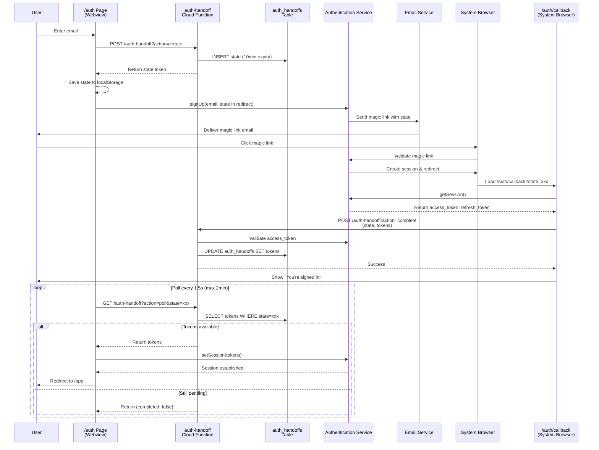

# Magic Link Authentication Architecture

## Current Implementation Note

**This project currently uses a simpler Realtime-based authentication approach** that works well for most use cases. This document describes a more complex, polling-based architecture that can be implemented if cross-device authentication issues arise.

### Current Realtime Implementation

The current system uses Lovable Cloud's Realtime channels to synchronize authentication across browser contexts:

1. User enters email and receives magic link with a `loginSyncId`
2. Magic link opens and establishes session (may be in different browser)
3. Session tokens are broadcast via Realtime channel using the `loginSyncId`
4. Original context listens to the channel and receives tokens automatically
5. Session established without polling

**Advantages of current approach:**
- ✅ Simpler implementation with fewer components
- ✅ Real-time token delivery (no polling delays)
- ✅ Fewer network requests
- ✅ More elegant user experience

**When to consider the polling architecture below:**
- Cross-device authentication failures reported by users
- Realtime channels prove unreliable in production
- Need database-backed audit trail for authentication events
- Require more granular error handling and timeout control

---

## Overview (Alternative Polling Architecture)

This document describes an alternative **magic link authentication system** designed to work seamlessly across different browsers, devices, and webview environments. The system solves a critical challenge: **storage isolation in webview contexts**, where magic links open in system browsers that don't share localStorage or session storage with the embedded webview.

### Key Technologies
- **Lovable Cloud Authentication**: Passwordless magic link authentication
- **Lovable Cloud Functions**: Server-side session handoff coordination
- **Lovable Cloud Database**: Temporary storage for session tokens during handoff
- **React**: Frontend state management and polling mechanism

### The Problem We Solve
When a user opens the app in a webview (embedded browser within a native app), clicking a magic link opens the system browser—a completely separate context with isolated storage. This means session tokens created in the system browser cannot be accessed by the original webview, breaking the authentication flow. Our solution uses a **secure server-mediated handoff mechanism** to transfer tokens between these isolated contexts.

---

## Architecture Diagram



---

## Why This Architecture?

### The Webview Storage Isolation Problem

**Webviews** are embedded browsers used by native mobile apps to display web content. They have a critical limitation:

1. **User opens app** → Webview loads with its own isolated storage
2. **User requests magic link** → Link is sent to email
3. **User clicks link** → Operating system opens the **system browser** (Safari, Chrome)
4. **Magic link creates session** → Tokens stored in system browser's localStorage
5. **Problem**: Webview and system browser **do not share storage**—tokens are inaccessible to the original webview

### Traditional Solutions Don't Work

❌ **Deep linking**: Requires native app integration, complex to implement  
❌ **Cookies**: Still isolated between webview and system browser  
❌ **OAuth popup**: Blocked by mobile browsers, poor UX  
❌ **In-app browser**: Not always available, inconsistent across platforms

### Our Solution: Server-Mediated Handoff

✅ **Secure state token** generated before sending magic link  
✅ **Tokens stored server-side** in database with short expiration  
✅ **Polling mechanism** allows original context to retrieve tokens  
✅ **Works across any browser/device combination**  
✅ **No native app integration required**

---

## Components Overview

### Frontend Components

#### 1. `/auth` Page (`src/pages/Auth.tsx`)
**Purpose**: Initiate authentication and coordinate session retrieval

**Key Responsibilities**:
- Collect user email
- Create handoff state via cloud function
- Send magic link with embedded state
- Poll for session completion
- Establish session when tokens received
- Redirect authenticated users

#### 2. `/auth/callback` Page (`src/pages/AuthCallback.tsx`)
**Purpose**: Complete the handoff by transferring tokens to backend

**Key Responsibilities**:
- Extract state from URL parameters
- Retrieve session tokens from authentication service
- Send tokens to backend for storage
- Display success message to user
- Handle both webview and direct callback scenarios

### Backend Components

#### 3. `auth-handoff` Cloud Function (`supabase/functions/auth-handoff/index.ts`)
**Purpose**: Coordinate secure token handoff between browser contexts

**Endpoints**:
- **POST `/auth-handoff?action=create`**: Generate and store state token
- **POST `/auth-handoff?action=complete`**: Validate and store session tokens
- **GET `/auth-handoff?action=poll`**: Retrieve tokens for pending handoffs

**Security Features**:
- Validates access tokens with authentication service before storage
- Cleans up expired handoff states automatically
- Returns CORS headers for cross-origin requests
- Single-use token pattern (deleted after retrieval)

### Database

#### 4. `auth_handoffs` Table
**Purpose**: Temporary storage for session handoff coordination

**Schema**:
```sql
CREATE TABLE public.auth_handoffs (
  state text PRIMARY KEY,                    -- Cryptographically random identifier
  access_token text,                         -- JWT access token (populated on complete)
  refresh_token text,                        -- JWT refresh token (populated on complete)
  completed_at timestamptz,                  -- Timestamp when handoff was completed
  expires_at timestamptz DEFAULT (now() + interval '10 minutes'), -- Automatic expiration
  created_at timestamptz DEFAULT now()       -- Record creation time
);
```

### Auth Provider

#### 5. `useAuth` Hook (`src/components/auth-provider.tsx`)
**Purpose**: Global authentication state management

**Features**:
- Listens to authentication state changes
- Maintains user and session in React context
- Handles cross-tab session synchronization
- Provides authentication utilities

---

## Authentication Flow Scenarios

### Scenario A: Same Browser Context (Simple Case)

**When**: User opens app in regular browser, clicks magic link in same browser

```
1. User enters email on /auth
2. Magic link sent to email
3. User clicks link → same browser tab
4. Authentication service creates session directly
5. /auth/callback detects no state parameter
6. Auth state listener detects session
7. User redirected to /chat
```

**Result**: Direct session establishment, no handoff needed ✅

---

### Scenario B: Cross-Browser/Cross-Device (Complex Case)

**When**: User opens app in webview, magic link opens in system browser

```
1. User enters email in webview /auth
2. Handoff state created and stored
3. Magic link sent with state parameter
4. User clicks link → opens in system browser (different storage context)
5. System browser establishes session (webview can't access it)
6. /auth/callback sends tokens to backend
7. Original webview polls backend
8. Webview receives tokens and establishes session
9. User redirected to /chat in webview
```

**Result**: Successful cross-context authentication via server-mediated handoff ✅

---

## Detailed Step-by-Step Flow

### Phase 1: Initiating Authentication

**Step 1**: User lands on `/auth` page and enters email address

**Step 2**: Frontend calls `auth-handoff` cloud function to create handoff state
```typescript
const response = await fetch(
  `${cloudUrl}/functions/v1/auth-handoff?action=create`,
  { method: 'POST', headers: {...} }
);
const { state } = await response.json();
```

**Step 3**: Cloud function generates cryptographically secure random state
```typescript
const state = crypto.randomUUID() + crypto.randomUUID(); // 32 bytes
```

**Step 4**: State stored in `auth_handoffs` table with 10-minute expiration
```sql
INSERT INTO auth_handoffs (state, expires_at) 
VALUES ($1, now() + interval '10 minutes');
```

**Step 5**: State saved to localStorage in original browser context
```typescript
localStorage.setItem('authHandoffState', state);
```

**Step 6**: Magic link sent with state embedded in redirect URL
```typescript
const redirectUrl = `${window.location.origin}/auth/callback?state=${state}`;
await supabase.auth.signUp({
  email,
  options: { emailRedirectTo: redirectUrl }
});
```

**Step 7**: User receives email with magic link containing state parameter

---

### Phase 2: Magic Link Click

**Step 8**: User clicks magic link in email client

**Step 9**: Link opens (may be in different browser, device, or context)
- Mobile: Often opens in system browser (Safari, Chrome)
- Desktop: May open in same or different browser tab
- Webview: Always opens in external browser

**Step 10**: Authentication service validates magic link and creates authenticated session
- Checks link validity and expiration
- Creates JWT access token and refresh token
- Stores session in current browser's localStorage

**Step 11**: Browser redirects to `/auth/callback?state=xxx`

---

### Phase 3: Session Handoff

**Step 12**: `AuthCallback` page loads and extracts state from URL
```typescript
const params = new URLSearchParams(window.location.search);
const state = params.get('state');
```

**Step 13**: Callback page retrieves session tokens from authentication service
```typescript
const { data: { session } } = await supabase.auth.getSession();
// session.access_token, session.refresh_token
```

**Step 14**: Tokens sent to cloud function to complete handoff
```typescript
await fetch(
  `${cloudUrl}/functions/v1/auth-handoff?action=complete`,
  {
    method: 'POST',
    body: JSON.stringify({
      state,
      access_token: session.access_token,
      refresh_token: session.refresh_token
    })
  }
);
```

**Step 15**: Cloud function validates access token
```typescript
const { data: { user }, error } = await supabaseClient.auth.getUser(access_token);
if (error) throw new Error('Invalid token');
```

**Step 16**: Tokens stored in database, marking handoff as complete
```sql
UPDATE auth_handoffs 
SET access_token = $1, 
    refresh_token = $2, 
    completed_at = now()
WHERE state = $3;
```

**Step 17**: User sees success message: "You're Signed In!"

---

### Phase 4: Session Retrieval (Polling)

**Step 18**: Original `/auth` page polls cloud function for completion
```typescript
const pollInterval = setInterval(async () => {
  const response = await fetch(
    `${cloudUrl}/functions/v1/auth-handoff?action=poll&state=${state}`
  );
  const data = await response.json();
  // Check if completed
}, 1500); // Every 1.5 seconds
```

**Step 19**: Cloud function queries database for tokens
```sql
SELECT access_token, refresh_token, completed_at 
FROM auth_handoffs 
WHERE state = $1 
  AND expires_at > now();
```

**Step 20**: When tokens available, response includes them
```json
{
  "completed": true,
  "access_token": "eyJhbGc...",
  "refresh_token": "eyJhbGc..."
}
```

**Step 21**: Frontend establishes session using retrieved tokens
```typescript
const { error } = await supabase.auth.setSession({
  access_token: data.access_token,
  refresh_token: data.refresh_token
});
```

**Step 22**: Auth state listener detects new session

**Step 23**: User automatically redirected to `/chat`

**Step 24**: Handoff record deleted from database (single-use pattern)

---

## Security Considerations

### 🔒 Cryptographic Security

**State Token Generation**:
```typescript
const state = crypto.randomUUID() + crypto.randomUUID(); // 72 characters, ~256 bits entropy
```
- Cryptographically secure random generation
- Sufficient entropy to prevent brute force attacks
- URL-safe characters only

### ⏱️ Time-Based Expiration

**10-Minute Window**:
- Handoff states expire automatically after 10 minutes
- Prevents long-lived attack surface
- Automatic cleanup of expired records
- Reasonable time for user to click link and complete flow

### 🔐 Token Validation

**Server-Side Verification**:
```typescript
const { data: { user }, error } = await supabaseClient.auth.getUser(access_token);
```
- Access tokens validated before storage
- Prevents storing forged or invalid tokens
- Ensures user actually authenticated
- Rejects expired or tampered tokens

### 🔑 Single-Use Pattern

**One-Time Retrieval**:
- Tokens deleted immediately after successful poll
- Prevents replay attacks
- State cannot be reused for multiple authentications
- Minimizes exposure window

### 🛡️ Row-Level Security

**Database Protection**:
```sql
ALTER TABLE auth_handoffs ENABLE ROW LEVEL SECURITY;
```
- RLS enabled on `auth_handoffs` table
- Cloud function uses service role for privileged access
- Direct database access blocked for unauthenticated users

### 🌐 CORS Configuration

**Cross-Origin Requests**:
```typescript
const corsHeaders = {
  'Access-Control-Allow-Origin': '*',
  'Access-Control-Allow-Headers': 'authorization, x-client-info, apikey, content-type',
};
```
- Properly configured CORS headers
- Allows legitimate cross-origin polling
- OPTIONS preflight handling

### 🚫 No Sensitive Data in URLs

**State Parameter Only**:
- URLs only contain random state token
- No email addresses, passwords, or user data
- State token is meaningless without database lookup
- Even if URL intercepted, cannot be exploited without access to database

---

## Edge Cases & Error Handling

### ⏰ Expired Handoff States

**Scenario**: User waits >10 minutes before clicking magic link

**Behavior**:
```typescript
// Database automatically excludes expired records
WHERE expires_at > now()
```
- Poll endpoint returns `{completed: false, error: 'Handoff expired or not found'}`
- Frontend shows timeout message
- User must request new magic link

**Resolution**: Request new authentication

---

### ⌛ Polling Timeout

**Scenario**: User never clicks magic link or completes handoff

**Configuration**:
```typescript
const maxAttempts = 80;        // Maximum poll attempts
const pollInterval = 1500;     // 1.5 seconds between polls
const timeout = 120000;        // 2 minutes total
```

**Behavior**:
- Frontend stops polling after 2 minutes
- Shows timeout message with option to retry
- Cleanup happens automatically in database

**Resolution**: User can click "Resend Magic Link" to start over

---

### 🔗 Missing or Invalid State Parameter

**Scenario A**: State parameter missing from callback URL

**Behavior**:
```typescript
if (!state) {
  // Assume direct callback (same browser context)
  const { data: { session } } = await supabase.auth.getSession();
  if (session) navigate('/chat');
}
```
- Treated as direct authentication (same browser)
- No handoff attempted
- Session established directly

**Scenario B**: State parameter invalid or not in database

**Behavior**:
- Poll returns error: "Handoff expired or not found"
- Complete endpoint rejects with 404
- User sees error message

**Resolution**: Request new magic link

---

### 🌐 Network Failures During Handoff

**Scenario**: Network interruption during token transfer

**Mitigation**:
- Frontend retries failed poll requests automatically
- Cloud function uses database transactions for atomicity
- Idempotent complete endpoint (can be called multiple times)

**Behavior**:
```typescript
try {
  await fetch(completeUrl, {...});
} catch (error) {
  console.error('Failed to complete handoff:', error);
  // Polling will retry automatically
}
```

---

### 📧 Rate Limiting on Email Sending

**Constraint**: Email rate limits may apply

**Behavior**:
```typescript
// Authentication service returns rate limit error
{
  error: "Email rate limit exceeded",
  code: "over_email_send_rate_limit"
}
```

**Frontend Handling**:
```typescript
if (error?.message?.includes('rate limit')) {
  toast({
    title: "Rate Limit Exceeded",
    description: "Too many emails sent. Please wait and try again.",
    variant: "destructive"
  });
}
```

**Resolution**: 
- User must wait for rate limit to reset
- Implement client-side cooldown tracking (optional)

---

### 🔄 Same Browser Context Fallback

**Scenario**: Magic link opens in same browser where app is running

**Optimization**:
```typescript
if (!state) {
  // Direct authentication, skip handoff
  const { data: { session } } = await supabase.auth.getSession();
  if (session) navigate('/chat', { replace: true });
}
```

**Behavior**:
- No polling needed
- Instant authentication
- More efficient UX
- Auth state listener handles redirect

---

## Code References

### Frontend

**Authentication Page**  
📄 `src/pages/Auth.tsx`
- Handoff state creation
- Magic link sending
- Polling logic and timeout handling
- Session establishment

**Callback Page**  
📄 `src/pages/AuthCallback.tsx` (if implemented)
- State parameter extraction
- Token retrieval from authentication service
- Handoff completion
- Success message display

**Auth Provider**  
📄 `src/components/auth-provider.tsx`
- Global auth state management
- Auth state change listeners
- Session persistence

---

### Backend

**Cloud Function**  
📄 `supabase/functions/auth-handoff/index.ts` (if implemented)
- Three endpoint actions: create, complete, poll
- State generation and validation
- Token validation
- Automatic cleanup of expired handoffs

**Database Schema**  
📄 Migration files in `supabase/migrations/`
- auth_handoffs table creation (if implemented)
- Indexes for performance
- RLS policies

---

### Configuration

**Authentication Client**  
📄 `src/integrations/supabase/client.ts`
- Client initialization
- Storage configuration (localStorage)
- Auto-refresh enabled
- Session persistence

**Environment Variables**  
📄 `.env` (auto-configured by Lovable Cloud)
- `VITE_SUPABASE_URL`
- `VITE_SUPABASE_PUBLISHABLE_KEY`

---

## Testing & Debugging

### Testing Cross-Device Flow

**Test Setup**:
1. **Device A** (Webview simulator):
   - Open app in Chrome with `?mode=app` URL parameter
   - This simulates webview environment
   
2. **Device B** (System browser):
   - Use different browser or incognito mode
   - This simulates where magic link opens

**Test Procedure**:
```
1. Device A: Enter email on /auth
2. Check email on Device B
3. Device B: Click magic link
4. Device B: Verify success message appears
5. Device A: Watch for automatic redirect to /chat
6. Device A: Verify authenticated session
```

---

### Console Logs to Monitor

**Auth Page** (`/auth`):
```javascript
console.log('Created handoff state:', state);
console.log('Magic link sent successfully');
console.log('Polling for handoff completion...');
console.log('Handoff completed! Tokens received:', data);
console.log('Session established successfully');
```

**Callback Page** (`/auth/callback`):
```javascript
console.log('Callback state:', state);
console.log('Session tokens:', { access_token, refresh_token });
console.log('Handoff completed successfully');
```

**Cloud Function Logs**:
```javascript
console.log('Creating handoff with state:', state);
console.log('Validating access token for user:', user.id);
console.log('Handoff completed for state:', state);
console.log('Polling for state:', state, 'Result:', completed);
```

---

### Debugging Checklist

**❌ Magic link not received**:
- [ ] Verify email address is correct
- [ ] Check spam folder
- [ ] Verify rate limit not exceeded
- [ ] Check backend logs for email sending errors

**❌ Polling times out**:
- [ ] Verify user clicked magic link
- [ ] Check callback page loaded successfully
- [ ] Check cloud function logs for errors
- [ ] Verify database connection
- [ ] Check if handoff state expired (>10 minutes)

**❌ Session not established**:
- [ ] Verify tokens received by polling
- [ ] Check `supabase.auth.setSession()` call
- [ ] Verify no CORS errors in network tab
- [ ] Check auth state listener is working
- [ ] Verify authentication client configuration

**❌ Redirect not working**:
- [ ] Check `navigate('/chat')` is called
- [ ] Verify auth context detects session
- [ ] Check auth guard logic
- [ ] Verify no React errors preventing render

---

### Network Request Monitoring

**Key Requests to Watch**:

1. **Create Handoff**:
```
POST /functions/v1/auth-handoff?action=create
Response: { state: "abc123..." }
```

2. **Magic Link Request**:
```
POST /auth/v1/signup (or signInWithOtp)
Body: { email, options: { emailRedirectTo } }
```

3. **Complete Handoff**:
```
POST /functions/v1/auth-handoff?action=complete
Body: { state, access_token, refresh_token }
Response: { success: true }
```

4. **Poll for Tokens** (repeated):
```
GET /functions/v1/auth-handoff?action=poll&state=abc123
Response: { completed: true, access_token, refresh_token }
```

5. **Set Session**:
```
POST /auth/v1/token?grant_type=refresh_token
Body: { refresh_token }
Response: { access_token, refresh_token, user }
```

---

## Configuration

### Environment Variables

**Required Variables** (auto-configured by Lovable Cloud):
```env
VITE_SUPABASE_URL=https://xxxxx.supabase.co
VITE_SUPABASE_PUBLISHABLE_KEY=eyJhbGc...
```

**Usage in Code**:
```typescript
const cloudUrl = import.meta.env.VITE_SUPABASE_URL;
const cloudKey = import.meta.env.VITE_SUPABASE_PUBLISHABLE_KEY;
```

---

### Authentication Configuration

**Redirect URLs** (configured in backend settings):
```
Site URL: https://your-app.lovable.app
Additional redirect URLs:
  - https://your-app.lovable.app/auth/callback
  - http://localhost:8080/auth/callback (development)
```

**Email Template**:
```
Confirm your signup

{{ .ConfirmationURL }}

This link will redirect you back to the app after authentication.
```

**Auto-confirm Email** (recommended for development):
```
Enable auto-confirm for faster testing in development
```

---

### Database Configuration

**Cloud Function Secrets** (auto-configured):
```
SUPABASE_URL
SUPABASE_ANON_KEY
SUPABASE_SERVICE_ROLE_KEY
```

**Database Cleanup** (automatic):
```sql
-- Expired handoffs are automatically filtered in queries
WHERE expires_at > now()

-- Optional: Add periodic cleanup job
DELETE FROM auth_handoffs 
WHERE expires_at < now();
```

---

## Performance Considerations

### Polling Optimization

**Current Configuration**:
- Poll interval: 1.5 seconds
- Max attempts: 80 (2 minutes total)
- Total requests: ~80 per authentication flow

**Potential Optimizations**:
```typescript
// Exponential backoff
const getInterval = (attempt) => Math.min(1000 * Math.pow(1.2, attempt), 5000);

// Reduce network usage
const pollInterval = attempt < 10 ? 1000 : 3000; // Fast at first, then slower
```

---

### Database Indexes

**Recommended Indexes**:
```sql
CREATE INDEX idx_auth_handoffs_state ON auth_handoffs(state);
CREATE INDEX idx_auth_handoffs_expires_at ON auth_handoffs(expires_at);
```

**Query Performance**:
- State lookups: O(log n) with B-tree index
- Expiration filtering: O(log n) with index
- Cleanup queries: Efficient with expires_at index

---

## Future Enhancements

### Potential Improvements

1. **WebSocket-based notifications** instead of polling
   - Real-time token delivery
   - Reduced server load
   - Better user experience

2. **QR code authentication** for cross-device flows
   - Scan QR on Device A
   - Opens URL on Device B
   - Instant authentication

3. **SMS fallback** for email delivery issues
   - Alternative to email magic links
   - Faster delivery
   - Better reliability

4. **Biometric authentication** for mobile apps
   - Face ID / Touch ID integration
   - Persistent device trust
   - Reduced friction

---

## Conclusion

This document describes an alternative magic link authentication architecture that provides a **robust, secure, and user-friendly** solution for cross-browser and cross-device authentication. The polling-based approach overcomes webview storage isolation through server-mediated token handoff.

**Current Implementation**: The project currently uses a simpler Realtime-based approach that achieves similar goals with less complexity. Consider implementing this polling architecture only if:
- Users report cross-device authentication failures
- Realtime channels prove unreliable
- Database audit trail is required
- More granular error handling is needed

The architecture documented here is designed to be:
- ✅ **Secure**: Cryptographic state tokens, token validation, time-based expiration
- ✅ **Reliable**: Handles edge cases, network failures, and multiple authentication scenarios
- ✅ **User-friendly**: Seamless flow across devices with clear feedback
- ✅ **Maintainable**: Well-documented, modular code with clear separation of concerns

For questions or improvements, refer to the code references above or consult the development team.
